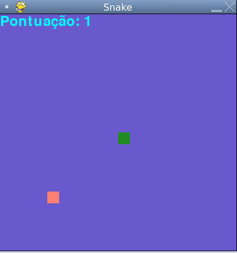

Snake Game
    

<h1 align="center">
    
    
</h1>
 
## About
    Projeto realizado durante a semana do Zero ao Python da Kezie Academy

## Game Screen

## 🛠 Technology

The following tools were used in the construction of the project:

- [Python](https://www.python.org/about/)
- [Pygame](https://www.pygame.org/wiki/GettingStarted)

## Author

Jefferson D'Antonio Malaquias 
